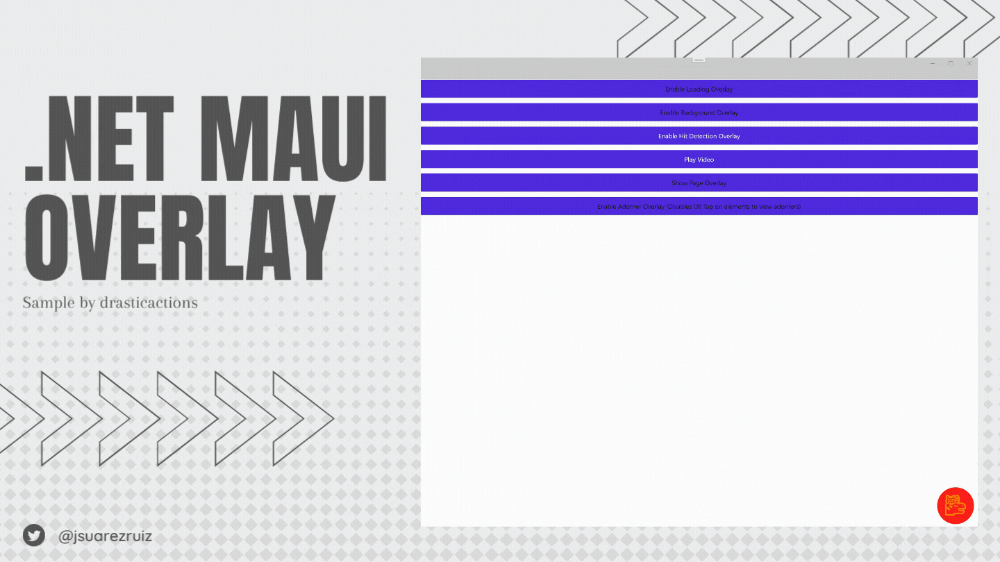

# .NET MAUI Overlay Playground - Fun with MAUI's `IWindowOverlay`

This repo contains some examples of MAUI `IWindowOverlay` implementations. While its primary use is for the `VisualDiagnostics` layer on `Window`, it can be used for much more.

NOTE: Sample by [Tim Miller](https://github.com/drasticactions) (team mate working in Visual Studio Tools at Microsoft).